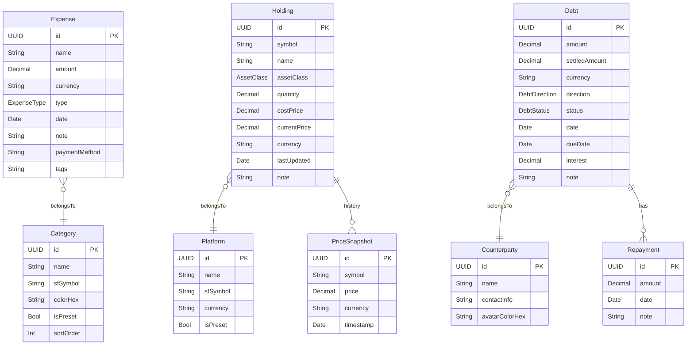

# Tally — 数据模型设计 (SwiftData)

> **版本**: v0.1 草稿 | **日期**: 2026-06-13
> 本文描述 SwiftData `@Model` 实体设计，不包含具体 Swift 实现代码。

---

## 一、实体关系图 (ER Diagram)



---

## 二、枚举定义

### ExpenseType
| 值 | 说明 |
|----|------|
| `.income` | 收入 |
| `.expense` | 支出（默认） |

### AssetClass
| 值 | 说明 | 示例 |
|----|------|------|
| `.crypto` | 加密货币 | BTC, ETH |
| `.usStock` | 美股 | AAPL, TSLA |
| `.aShare` | A股 | 600519, 000858 |
| `.hkStock` | 港股 | 00700, 03690 |
| `.fund` | 基金（含ETF） | 000001, SPY |
| `.other` | 其他 | 黄金、房产等 |

### DebtDirection
| 值 | 说明 |
|----|------|
| `.owedToMe` | 外债（别人欠我）|
| `.iOwe` | 我欠（我欠别人）|

### DebtStatus
| 值 | 说明 | 触发条件 |
|----|------|---------|
| `.open` | 未还清 | 初始状态 |
| `.partial` | 部分还清 | `settledAmount > 0 && settledAmount < amount` |
| `.settled` | 已结清 | `settledAmount >= amount` |

---

## 三、实体字段详述

### 3.1 Expense（日常支出/收入记录）

| 字段名 | 类型 | 约束 | 说明 |
|--------|------|------|------|
| `id` | `UUID` | PK, 自动生成 | 唯一标识 |
| `name` | `String` | 非空，≤50字符 | 花费名称 |
| `amount` | `Decimal` | 非空，> 0 | 金额（正数，类型决定方向） |
| `currency` | `String` | 非空，默认 `"CNY"` | ISO 4217 货币代码 |
| `type` | `ExpenseType` | 非空，默认 `.expense` | 收入/支出 |
| `category` | `Category` | 非空，级联 | 关联分类 |
| `date` | `Date` | 非空，默认当前时间 | 发生时间 |
| `note` | `String?` | 可空，≤200字符 | 备注 |
| `paymentMethod` | `String?` | 可空 | 支付方式（现金/微信/支付宝/银行卡/信用卡/其他） |
| `tags` | `[String]` | 可空，JSON存储 | 自由标签 |
| `createdAt` | `Date` | 自动设置 | 创建时间（用于排序一致性） |

**关联**：`category` → `Category`（多对一）

---

### 3.2 Category（分类）

| 字段名 | 类型 | 约束 | 说明 |
|--------|------|------|------|
| `id` | `UUID` | PK | 唯一标识 |
| `name` | `String` | 非空，唯一，≤20字符 | 分类名称 |
| `sfSymbol` | `String` | 非空 | SF Symbols 图标名称 |
| `colorHex` | `String` | 非空，格式 `#RRGGBB` | 颜色 |
| `isPreset` | `Bool` | 非空，默认 `false` | 是否为系统预置（不可删除） |
| `isHidden` | `Bool` | 非空，默认 `false` | 是否在快捷选择中隐藏 |
| `sortOrder` | `Int` | 非空，默认递增 | 显示顺序 |
| `expenseType` | `ExpenseType?` | 可空 | 若指定，限定此分类只用于收入或支出 |

**关联**：`expenses` → `[Expense]`（一对多，反向）

---

### 3.3 Holding（持仓）

| 字段名 | 类型 | 约束 | 说明 |
|--------|------|------|------|
| `id` | `UUID` | PK | 唯一标识 |
| `symbol` | `String` | 非空，≤20字符 | 标的代码（如 `BTC`、`AAPL`） |
| `name` | `String` | 非空，≤50字符 | 标的名称（如"比特币"） |
| `assetClass` | `AssetClass` | 非空 | 资产类别 |
| `platform` | `Platform` | 非空，级联 | 所属平台 |
| `quantity` | `Decimal` | 非空，> 0 | 持仓数量 |
| `costPrice` | `Decimal` | 非空，> 0 | 成本价（每单位） |
| `currentPrice` | `Decimal?` | 可空 | 现价（手动录入或API更新） |
| `currency` | `String` | 非空，默认 `"USD"` | 计价币种 |
| `lastUpdated` | `Date?` | 可空 | 价格最后更新时间 |
| `note` | `String?` | 可空，≤200字符 | 备注 |
| `createdAt` | `Date` | 自动设置 | 创建时间 |

**计算属性**（不存数据库）：
- `marketValue` = `currentPrice * quantity`（当前市值）
- `costValue` = `costPrice * quantity`（成本总额）
- `gainLoss` = `marketValue - costValue`（浮动盈亏）
- `gainLossPercent` = `gainLoss / costValue * 100`（收益率%）
- `isPriceStale` = `lastUpdated < Date.now - 3600s`（价格是否过期）

**关联**：
- `platform` → `Platform`（多对一）
- `priceHistory` → `[PriceSnapshot]`（一对多）

---

### 3.4 Platform（投资平台）

| 字段名 | 类型 | 约束 | 说明 |
|--------|------|------|------|
| `id` | `UUID` | PK | 唯一标识 |
| `name` | `String` | 非空，唯一，≤30字符 | 平台名称 |
| `sfSymbol` | `String?` | 可空 | SF Symbol 图标（可选） |
| `defaultCurrency` | `String` | 非空，默认 `"CNY"` | 平台默认币种 |
| `isPreset` | `Bool` | 非空，默认 `false` | 系统预置平台 |
| `sortOrder` | `Int` | 非空，默认递增 | 显示顺序 |

**关联**：`holdings` → `[Holding]`（一对多，反向）

**预置平台**：富途、老虎证券、币安、欧易(OKX)、支付宝(基金)、雪球、其他。

---

### 3.5 Debt（借贷记录）

| 字段名 | 类型 | 约束 | 说明 |
|--------|------|------|------|
| `id` | `UUID` | PK | 唯一标识 |
| `counterparty` | `Counterparty` | 非空，级联 | 对手方 |
| `direction` | `DebtDirection` | 非空 | 方向（我欠/外债） |
| `amount` | `Decimal` | 非空，> 0 | 借贷总金额 |
| `settledAmount` | `Decimal` | 非空，默认 0，≥0 | 已还清金额（由 Repayment 累加） |
| `currency` | `String` | 非空，默认 `"CNY"` | 币种 |
| `status` | `DebtStatus` | 非空，默认 `.open` | 结算状态（自动计算） |
| `date` | `Date` | 非空，默认当前时间 | 发生日期 |
| `dueDate` | `Date?` | 可空 | 到期日 |
| `interest` | `Decimal?` | 可空，≥0，单位% | 年化利率（0=免息） |
| `note` | `String?` | 可空，≤300字符 | 备注 |

**计算属性**：
- `remainingAmount` = `amount - settledAmount`（剩余未还金额）
- `isOverdue` = `dueDate != nil && dueDate < Date.now && status != .settled`（是否已逾期）

**关联**：
- `counterparty` → `Counterparty`（多对一）
- `repayments` → `[Repayment]`（一对多，按 date 排序）

---

### 3.6 Counterparty（对手方）

| 字段名 | 类型 | 约束 | 说明 |
|--------|------|------|------|
| `id` | `UUID` | PK | 唯一标识 |
| `name` | `String` | 非空，≤30字符 | 姓名 |
| `contactInfo` | `String?` | 可空，≤50字符 | 联系方式（电话/微信号） |
| `avatarColorHex` | `String` | 非空，随机分配 | 无头像时显示的颜色 |

**计算属性**：
- `totalOwedToMe` — 该对手方欠我的合计（未结清）
- `totalIOwe` — 我欠该对手方的合计（未结清）
- `netBalance` — 净债权/债务（正=外债，负=我欠）

**关联**：`debts` → `[Debt]`（一对多，反向）

---

### 3.7 Repayment（还款记录）

| 字段名 | 类型 | 约束 | 说明 |
|--------|------|------|------|
| `id` | `UUID` | PK | 唯一标识 |
| `debt` | `Debt` | 非空，级联 | 关联借贷 |
| `amount` | `Decimal` | 非空，> 0 | 本次还款金额 |
| `date` | `Date` | 非空，默认当前时间 | 还款日期 |
| `note` | `String?` | 可空，≤200字符 | 备注 |

**触发逻辑**：新增 Repayment 后，自动更新 `Debt.settledAmount` 并重新计算 `Debt.status`。

---

### 3.8 PriceSnapshot（价格历史快照）

| 字段名 | 类型 | 约束 | 说明 |
|--------|------|------|------|
| `id` | `UUID` | PK | 唯一标识 |
| `holding` | `Holding` | 非空，级联 | 关联持仓 |
| `price` | `Decimal` | 非空，> 0 | 快照价格 |
| `currency` | `String` | 非空 | 计价币种 |
| `timestamp` | `Date` | 非空 | 快照时间 |

每次手动刷新价格时，同时保存一条快照，用于绘制总市值趋势折线图。保留最近 365 条快照（按标的）。

---

## 四、聚合查询设计

### 4.1 日常账本统计

**按区间统计收支**（账本统计页使用）：

```
目标：给定 startDate 和 endDate，汇总 totalIncome, totalExpense, netBalance
Predicate：expense.date >= startDate && expense.date < endDate
聚合：对 expense 按 type 分组，对 amount 求和
```

**按分类汇总**（分类占比饼图）：

```
目标：相同区间内，按 category 分组求和
Predicate：同上 + type == .expense
分组：按 category.id 分组
```

**每日收支趋势**（柱状图）：

```
目标：相同区间内，按日分组求 income 和 expense 之和
分组：按 Calendar.current.startOfDay(for: expense.date) 分组
```

**同环比计算**：

```
目标：本期总支出 vs 上一同等时段总支出
上期区间：根据时间段类型自动推算（月→上月，周→上周，年→上年）
delta = currentTotal - previousTotal
percent = delta / previousTotal * 100
```

---

### 4.2 投资组合汇总

**按平台分组**：

```
目标：按 platform 分组，计算每个平台的 totalMarketValue, totalCostValue, gainLoss
所有持仓 currentPrice 换算为基础货币（CNY）后再汇总
```

**总市值趋势**（折线图）：

```
目标：按日取最近 N 天的总市值数据点
数据源：PriceSnapshot，每个 symbol 取当天最新快照价 × quantity 求和
```

---

### 4.3 信用账本汇总

**净债权/债务**：

```
totalOwedToMe = SUM(debt.remainingAmount) WHERE direction == .owedToMe && status != .settled
totalIOwe     = SUM(debt.remainingAmount) WHERE direction == .iOwe     && status != .settled
netBalance    = totalOwedToMe - totalIOwe（正=净债权，负=净债务）
```

**即将到期**（通知触发）：

```
SELECT * FROM Debt WHERE dueDate BETWEEN now AND now+3days AND status != .settled
```

---

## 五、数据生命周期

| 操作 | 级联行为 |
|------|---------|
| 删除 Category | 若有关联 Expense，拒绝删除（或改为"其他"） |
| 删除 Platform | 若有关联 Holding，拒绝删除 |
| 删除 Holding | 级联删除所有 PriceSnapshot |
| 删除 Debt | 级联删除所有 Repayment |
| 删除 Counterparty | 仅当无未结清 Debt 时允许删除 |

---

## 六、数据迁移策略

SwiftData 通过 `VersionedSchema` + `SchemaMigrationPlan` 管理迁移。

- 每次增加字段（`Optional` 新字段）：轻量迁移（Lightweight Migration），自动处理。
- 字段重命名或删除：需声明显式迁移步骤（Custom Migration Stage）。
- 原则：新字段优先使用 `Optional` 或提供默认值，减少破坏性迁移。
